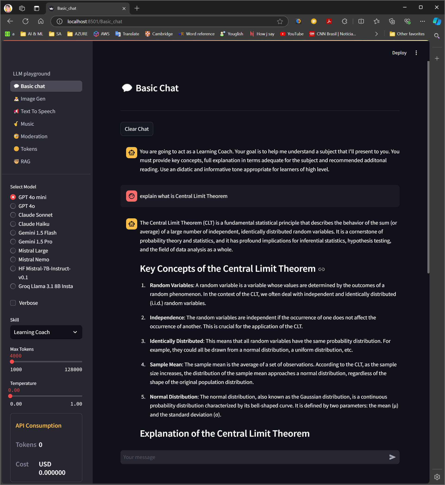
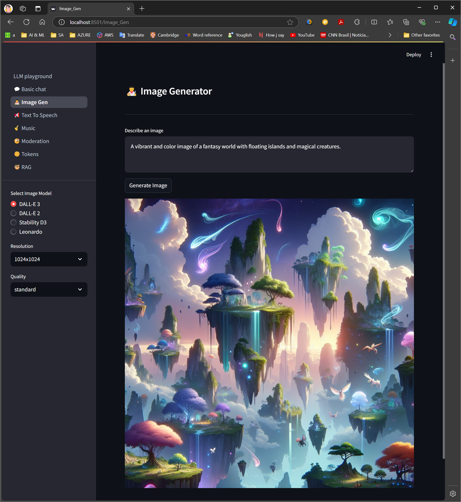
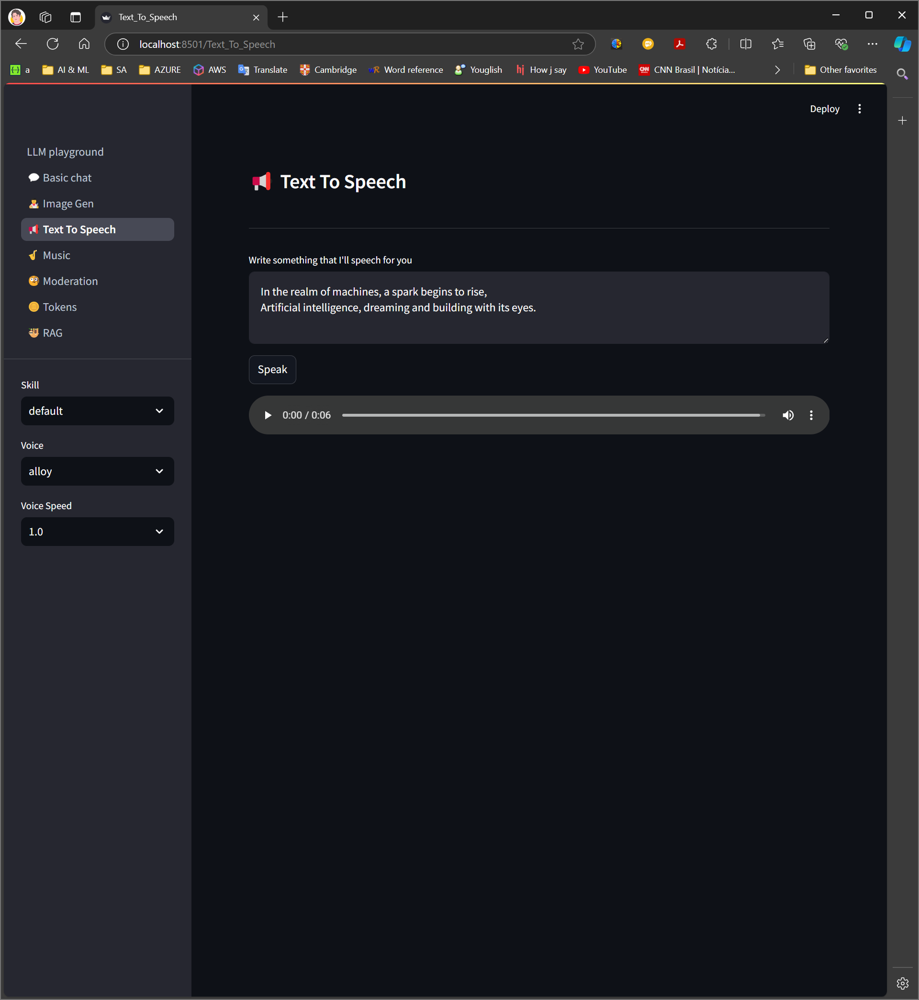
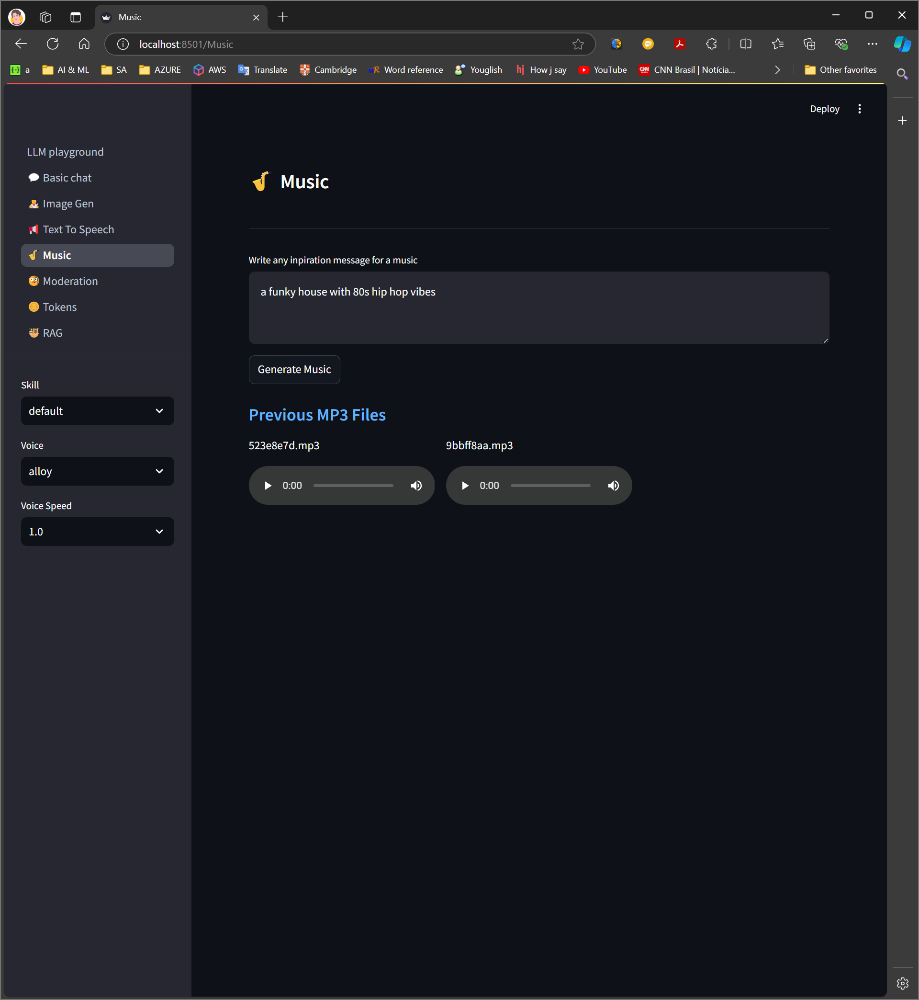
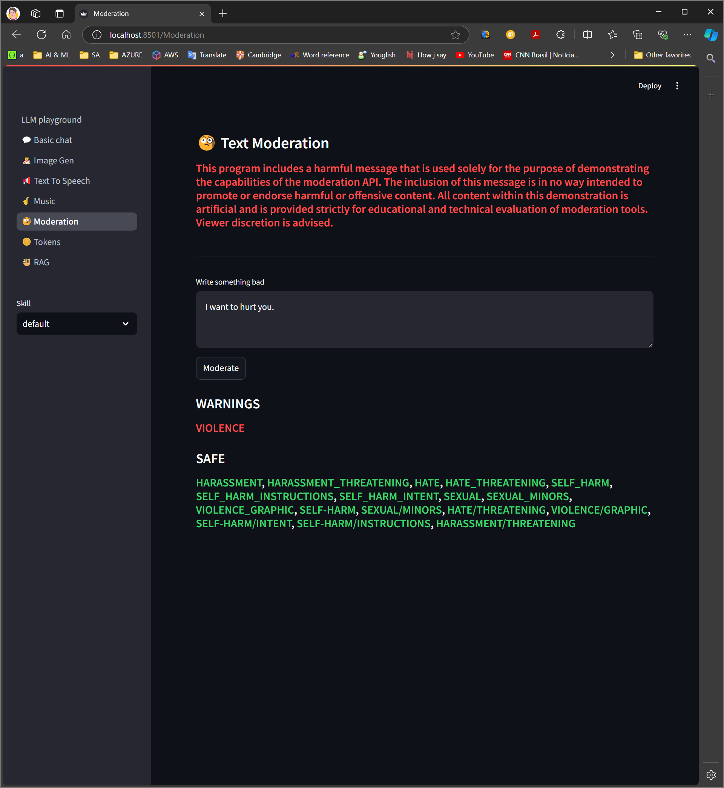
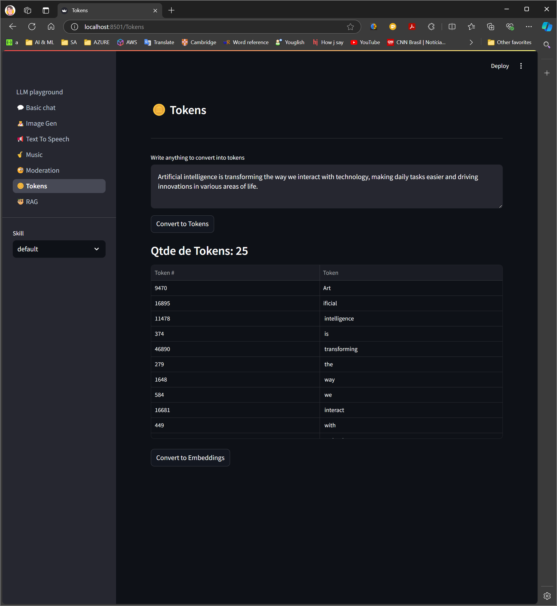
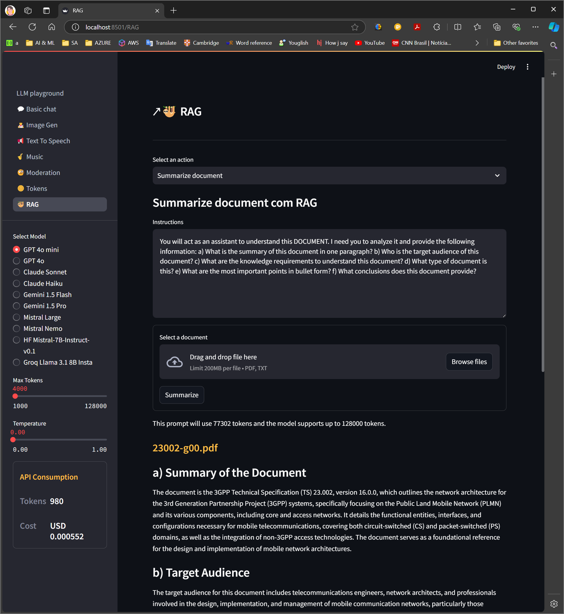

# LLM_playground
An educational playground for exploring and demonstrating various use cases and concepts of Large Language Models (LLMs). This repository provides examples of utilizing LLM APIs for different tasks, making it easier for developers to integrate LLMs into their projects.










## Installation

1. Clone the repository:
```sh
git clone https://github.com/marquezea/LLM_playground.git
```
2. Navigate to the project directory:
```sh
cd LLM_playground
```
3. Install the python libraries:
```sh
pip install -r requirements.txt
```

## Setting API Keys

This applications invokes LLM APIs from different providers. You must have API KEYs for all the services that you intend to use. The following API KEYs are used in this project but you can decide which one to use.
- OPENAI_API_KEY [www.openai.com](https://openai.com/index/openai-api/)
- ANTHROPIC_API_KEY [Anthropic API](https://support.anthropic.com/en/collections/5370014-anthropic-api-api-console)
- STABILITY_API_KEY [Stability AI](https://stability.ai/)
- LEONARDO_API_KEY [Leonardo API](https://leonardo.ai/api/)
- GEMINI_API_KEY [Google Gemini API](https://ai.google.dev/gemini-api/docs/api-key)
- MISTRAL_API_KEY [Mistral API](https://docs.mistral.ai/api/)
- HFINF_API_KEY [Hugging Face API](https://huggingface.co/docs/api-inference/index)
- GROQ_API_KEY [Groq API](https://console.groq.com/keys)

Below is an explanation of how to setup the environment variables.

##### 1. Windows:
- Open Command Prompt or PowerShell.
- Use the following command to set the environment variable for the current session:
```sh
set OPENAI_API_KEY=<your api key>
```
- To make it persistent, add the variable to the system environment variables:
  - Search for "Environment Variables" in the start menu.
  - Click on "Edit the system environment variables."
  - In the System Properties window, click "Environment Variables."
  - Under "User variables" or "System variables," click "New" and add OPENAI_API_KEY as the name and your API key as the value.

##### 2. Linux:
- Open your terminal.
- Set the environment variable for the current session with:
```sh
export OPENAI_API_KEY=<your api key>
```
To make it permanent, add the following line to your shell configuration file (~/.bashrc, ~/.zshrc, etc.):
```sh
export OPENAI_API_KEY=<your api key>
```
- Save the file and run source ~/.bashrc (or the equivalent for your shell) to apply the changes.

##### 3. macOS:
- Open your terminal.
- Set the environment variable for the current session:
```sh
export OPENAI_API_KEY=<your api key>
```
- To make it permanent, add the following line to your shell configuration file (~/.bash_profile, ~/.zshrc, etc.):
```sh
export OPENAI_API_KEY=<your api key>
```
Save the file and run source ~/.bash_profile (or the equivalent for your shell) to apply the changes.


## Usage

To start the application use the following command:
```sh
streamlit run LLM_playground
```

## License

This project is licensed under the MIT License - see the LICENSE file for details.


## Contact Information

Adriano Marqueze
adriano.marqueze@gmail.com